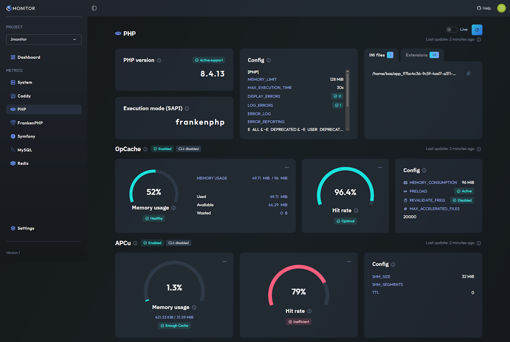

# Jmonitor

### Simple monitoring for PHP & Symfony stacks

Plug the collectors, get clear dashboards in minutes — without building and maintaining a Grafana/Prometheus stack.

[](https://packagist.org/packages/jmonitor/collector)
[](https://packagist.org/packages/jmonitor/collector)
[](https://github.com/jmonitor/collector/actions)
[](LICENSE)
[](https://github.com/jmonitor/collector/commits)

[**Website**](https://jmonitor.io) · [**Symfony bundle** (optional)](https://github.com/jmonitor/jmonitor-bundle)



## Why Jmonitor?

Grafana, Prometheus and Datadog are powerful, but they take time to configure and expertise to run. Jmonitor focuses on getting you readable dashboards fast, made for the PHP world.

- **Built for the PHP/Symfony ecosystem** — dedicated collectors for MySQL, Redis, Apache, Nginx, Caddy, PHP, FrankenPHP & PostgreSQL, plus a Symfony bundle for drop-in integration.
- **Readable out of the box** — premade dashboards (gauges + graphs) anyone on the team can understand, not just observability experts.
- **Lightweight to install** — a small PHP collector library running as a worker. No agent, no heavy infra to maintain.
- **Multi-project & team-ready** — manage several projects with role-based access (Owner / Admin / Member).

> Jmonitor monitors itself with Jmonitor.

---

**This package** provides the PHP collectors that gather metrics and send them to [Jmonitor.io](https://jmonitor.io). For Symfony projects, use the [Jmonitor bundle](https://github.com/jmonitor/jmonitor-bundle) for drop-in integration.

## Requirements
- PHP 8.1+ (for PHP 7.4/8.0, use the [1.x branch](https://github.com/jmonitor/collector/tree/1.x))
- A project using [Composer](https://getcomposer.org/)

## Installation

```bash
composer require jmonitor/collector
```

Quick Start
---------------
Create a project in [jmonitor.io](https://jmonitor.io) and get your API key.

Then, create a separate script and start collecting metrics:

```php
use Jmonitor\Jmonitor;
use Jmonitor\Collector\Apache\ApacheCollector;

$jmonitor = new Jmonitor('apiKey');

// Add some collectors... see the documentation below for more collectors
$jmonitor->addCollector(new ApacheCollector('https://example.com/server-status'));
$jmonitor->addCollector(new SystemCollector());
// ... 

// send metrics to Jmonitor (see "Running the collector" section)
$jmonitor->collect();
```

### HTTP Client (PSR-18)
You can inject any PSR-18 HTTP client (e.g., Symfony HttpClient via Psr18Client, Guzzle via an adapter, etc.). Example :

```bash
composer require symfony/http-client nyholm/psr7
```

```php
use Symfony\Component\HttpClient\Psr18Client;

$httpClient = ... // create or retrieve your Symfony HttpClient instance
$client = (new Psr18Client())->withOptions(...);

$jmonitor = new Jmonitor('apiKey', $client);
```

Running the collector
-------------------
The collector is designed to be run as a worker in a separate process.

This means you **must not** integrate it into your application and call `$jmonitor->collect()` on every web request.
  
One basic worker script is provided in the `examples` folder. Copy it into your project, update it to include the collectors you need, and run it from CLI.

In production, it is recommended to run the worker under a process manager (e.g. Supervisor or systemd) to ensure it is kept running and restarted periodically.
For practical guidance, you can follow Symfony Messenger's recommendations:  
https://symfony.com/doc/current/messenger.html#deploying-to-production

You also can take a look at the CollectorCommand from the Symfony bundle for a more advanced example:  
https://github.com/jmonitor/jmonitor-bundle/blob/master/src/Command/CollectorCommand.php

Some metrics are fairly static and remain cached for the lifetime of the collector, so among others reasons (memory, ...), it is **strongly recommended** to restart the collector regularly, at least once a day.

Debugging and Error Handling
-----------------------------
Each collector is isolated and executed within a try/catch block.  
Use the CollectionResult returned by `collect()` method to inspect outcomes.

By default, collect() call send metrics to Jmonitor.  
You can disable this by passing `send: false`

By default, collect() do not throws when the server response status code is >= 400.  
You can disable this by passing `throwOnFailure: false`

Finally, you can pass a PSR-3 logger to the constructor to get more detailed information about the collection process. You will receive messages ranging from debug to error level.

```php
use Psr\Http\Message\ResponseInterface;
use Jmonitor\CollectionResult;
use Jmonitor\Jmonitor;

$jmonitor = new Jmonitor('apiKey', logger: new SomeLogger());

/**
 * Send metrics, you can :
 * - Disable throwing an exception on error
 * - Disable sending metrics to the server
 */
$result = $jmonitor->collect(throwOnFailure: false);
// Or disable completely the sending of metrics to the server
$result = $jmonitor->collect(send: false);

/**
 * Use $result to inspect
 */
// Human-readable summary (string)
$conclusion = $result->getConclusion(); 

// List of Exceptions if any (\Throwable[])
$errors = $result->getErrors(); 

// The raw response from jmonitor, if any (ResponseInterface|null)
$response = $result->getResponse(); 

// All metrics collected (mixed[])
$metrics = $result->getMetrics();
```

Collectors
-----------

- [System](#system)
- [Apache](#apache)
- [Nginx](#nginx)
- [Mysql](#mysql)
- [Php](#php)
- [Redis](#redis)
- [Caddy](#caddy)
- [FrankenPHP](#frankenphp)
- [PostgreSQL](#postgresql)

- ### System <a name="system"></a>
  Collects system metrics like CPU usage, memory usage, disk usage, etc.
  Linux only for now. Feel free to open an issue if you need other OS support.

  ```php
  use Jmonitor\Collector\System\SystemCollector;
  
  $collector = new SystemCollector();
  
  // There is actually a "RandomAdapter" you can use on a Windows OS for testing purposes
  $collector = new SystemCollector(new RandomAdapter());
  ```

- ### Apache <a name="apache"></a> 
  Collects metrics from Apache "mod_status" module. Enable it and expose a status URL.
  There are some resources to help you with that:
  - Apache docs (FR - EN): https://httpd.apache.org/docs/current/mod/mod_status.html.
  - Guide (EN): https://statuslist.app/apache/apache-status-page-simple-setup-guide/
  - Guide (FR): https://www.blog.florian-bogey.fr/activer-et-configurer-le-server-status-apache-mod_status.html  

  ```php
  use Jmonitor\Collector\Apache\ApacheCollector;
  
  $collector = new ApacheCollector('http://localhost/server-status');
  ```

- ### Nginx <a name="nginx"></a>
  Collects metrics from Nginx "stub_status" module. Enable it and expose a status URL.
  There are some resources to help you with that:
  - Nginx docs (EN): https://nginx.org/en/docs/http/ngx_http_stub_status_module.html
  - Stackoverflow (EN): https://stackoverflow.com/questions/62269902/nginx-how-to-create-status-with-stub-status
  - Guide (EN): https://easyengine.io/tutorials/nginx/status-page/
  
  ```php
  use Jmonitor\Collector\Nginx\NginxCollector;
  
  $collector = new NginxCollector('http://localhost/nginx_status');
  ```
- ### Mysql <a name="mysql"></a>
  Collects MySQL metrics from variables, status, and the `performance_schema` and `information_schema` tables if availables.  
  Connect via PDO or Doctrine DBAL (open an issue if you need other drivers, e.g., mysqli).
    
  ```php
  use Jmonitor\Collector\Mysql\MysqlCollector;
  use Jmonitor\Collector\Mysql\Adapter\PdoAdapter;
  use Jmonitor\Collector\Mysql\Adapter\DoctrineAdapter;
  use Jmonitor\Collector\Mysql\MysqlStatusCollector;
  use Jmonitor\Collector\Mysql\MysqlVariablesCollector;
  use Jmonitor\Collector\Mysql\MysqlInformationSchemaCollector
  use Jmonitor\Collector\Mysql\MysqlSlowQueriesCollector
  
  // Using PDO
  $adapter = new PdoAdapter($pdo); // your \PDO instance
  
  // or using Doctrine DBAL
  $adapter = new DoctrineAdapter($connection); // your Doctrine\DBAL\Connection instance
  
  // Mysql has multiple collectors, use the same adapter for all of them
  $collector = new MysqlInformationSchemaCollector($adapter, 'your_db_name');
  $collector = new MysqlSlowQueriesCollector($adapter, 'your_db_name');
  $collector = new MysqlStatusCollector($adapter);
  $collector = new MysqlVariablesCollector($adapter);
  
  // The slow queries collector can be configured to filter results:
  // - limit: maximum number of results to return (1–10, default: 5)
  // - minExecCount: minimum number of executions required to include a query (default: 1)
  // - minAvgTimeMs: minimum average execution time (in ms) for a query to be considered slow (default: 0)
  // - orderBy: column used for sorting; allowed values are "sum", "avg", "max" 
  //   (see constants in MysqlSlowQueriesCollector, default: "avg")
  $collector = new MysqlSlowQueriesCollector($adapter, 'your_db_name', $limit, $minExecCount, $minAvgTimeMs, $orderBy);
  ```

- ### PHP <a name="php"></a>
  Collects PHP metrics (loaded extensions, some ini keys, FPM, opcache, etc.).  
  
> [!IMPORTANT]
>
> PHP configuration can differ significantly between CLI and web server.  
> To collect web‑server context metrics from a CLI script, which is probably what you want to do, expose an HTTP endpoint that returns these metrics as JSON (see below).

  - Collect CLI-context metrics (current context)
    ```php
    use Jmonitor\Collector\Php\PhpCollector;
   
    $collector = new PhpCollector();
    ```

  - Collect web-server context metrics from CLI  
    Expose a metrics endpoint (and **make sure it is properly secured**). You can reuse php-exposer.php from this repo or create your own:
    ```php
    <?php
  
    use Jmonitor\Collector\Php\PhpCollector;
  
    require __DIR__ . '/../vendor/autoload.php';

    header('Content-Type: application/json');
    
    echo json_encode((new PhpCollector())->collect(), JSON_THROW_ON_ERROR);
    ```

    Then, in your CLI script, point the collector to that URL:    

    ```php
    use Jmonitor\Collector\Php\PhpCollector;

    $collector = new PhpCollector('https://localhost/php-metrics.php');
    ```

- ### Redis <a name="redis"></a>
  Collects Redis metrics from the INFO command.
  
  ```php
  use Jmonitor\Collector\Redis\RedisCollector;
  
  // Any client supporting INFO: PhpRedis, Predis, RedisArray, RedisCluster, Relay...
  $redis = new \Redis([...]);
  
  $collector = new RedisCollector($redis);
  ```

- ### Caddy <a name="caddy"></a>
  Collects from the [Caddy](https://caddyserver.com/docs/metrics) metrics endpoint. See below if you also use FrankenPhp.

  ```php
  use Jmonitor\Collector\Caddy\CaddyCollector
  use Jmonitor\Prometheus\PrometheusMetricsProvider;
  
  $collector = new CaddyCollector(new PrometheusMetricsProvider('http://localhost:2019/metrics'));
  ```
- ### FrankenPHP <a name="frankenphp"></a>
  Collects from the [Caddy](https://caddyserver.com/docs/metrics) metrics endpoint of [FrankenPHP](https://frankenphp.dev/docs/metrics/).
  You must reuse the PrometheusMetricsProvider instance for both collectors to avoid an unnecessary extra HTTP request.

  ```php
  use Jmonitor\Collector\Caddy\CaddyCollector
  use Jmonitor\Prometheus\PrometheusMetricsProvider;
  use Jmonitor\Collector\FrankenPhp\FrankenPhpCollector;
  
  $metricsProvider = new PrometheusMetricsProvider('http://localhost:2019/metrics');
  
  $caddyCollector = new CaddyCollector($metricsProvider);
  $frankenPhpCollector = new FrankenPhpCollector($metricsProvider);
  ```

- ### PostgreSQL <a name="postgresql"></a>
  Collects PostgreSQL metrics from system catalog views (`pg_stat_database`, `pg_stat_activity`, `pg_stat_bgwriter`, etc.).  
  Connect via PDO or Doctrine DBAL.

  ```php
  use Jmonitor\Collector\Postgresql\PostgresqlActivityCollector;
  use Jmonitor\Collector\Postgresql\PostgresqlDatabaseCollector;
  use Jmonitor\Collector\Postgresql\PostgresqlSettingsCollector;
  use Jmonitor\Collector\Postgresql\PostgresqlSlowQueriesCollector;
  use Jmonitor\Utils\DatabaseAdapter\PdoAdapter;
  use Jmonitor\Utils\DatabaseAdapter\DoctrineAdapter;

  // Using PDO
  $adapter = new PdoAdapter($pdo); // your \PDO instance

  // or using Doctrine DBAL
  $adapter = new DoctrineAdapter($connection); // your Doctrine\DBAL\Connection instance

  // PostgreSQL has multiple collectors; use the same adapter for all of them
  $collector = new PostgresqlActivityCollector($adapter);
  $collector = new PostgresqlSettingsCollector($adapter);
  $collector = new PostgresqlDatabaseCollector($adapter);               // defaults to schema 'public'
  $collector = new PostgresqlDatabaseCollector($adapter, 'my_schema');  // custom schema
  $collector = new PostgresqlSlowQueriesCollector($adapter);
  ```

  **`PostgresqlSlowQueriesCollector`** requires the [`pg_stat_statements`](https://www.postgresql.org/docs/current/pgstatstatements.html) extension.  
  Add it to `shared_preload_libraries` in `postgresql.conf` and restart PostgreSQL, then run:
  ```sql
  CREATE EXTENSION IF NOT EXISTS pg_stat_statements;
  ```
  Pass `autoCreateExtension: true` to let the collector create it automatically (requires superuser or CREATE privileges):

  ```php
  // The slow queries collector can be configured:
  // - limit: maximum number of results (default: 10)
  // - minCalls: minimum number of executions to include a query (default: 1)
  // - minMeanTimeMs: minimum average execution time in ms (default: 0)
  // - orderBy: "avg", "total", or "max" (see constants in PostgresqlSlowQueriesCollector, default: "avg")
  // - autoCreateExtension: create pg_stat_statements if missing (default: false)
  $collector = new PostgresqlSlowQueriesCollector($adapter, limit: 10, minCalls: 5, minMeanTimeMs: 100.0, orderBy: PostgresqlSlowQueriesCollector::ORDER_BY_AVG_TIME);
  ```

Integrations
------------
- Symfony: https://github.com/jmonitor/jmonitor-bundle

Roadmap
-------
- Custom metrics collection

---

Need help?
- Open an issue on this repo https://github.com/jmonitor/collector/issues
- Open a discussion on https://github.com/orgs/jmonitor/discussions
